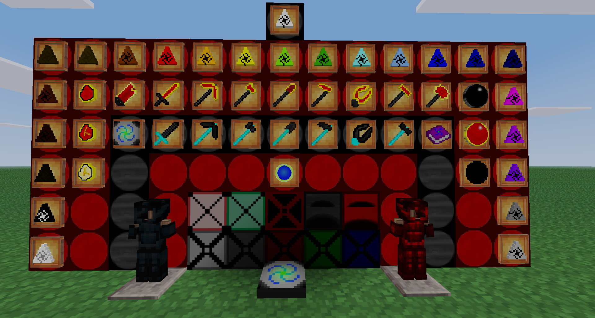
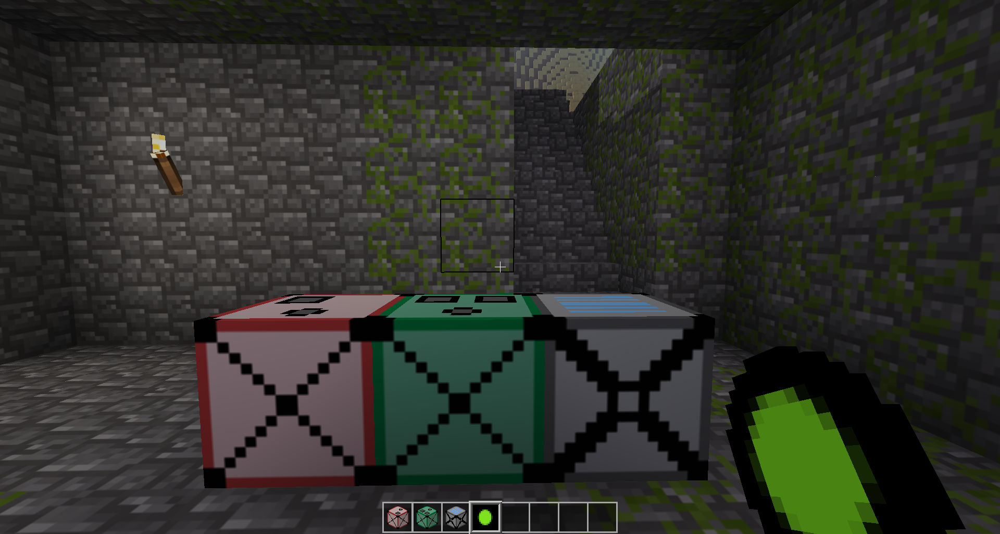

# ExchangeClone
Allows players to turn nodes into energy (stored in orbs), and energy from orbs into nodes. Supports all items in Minetest Game and MineClone 2!

Includes other things from Equivalent Exchange (the MineCraft mod)

[GitHub repo](https://github.com/thepython10110/exchangeclone)

[Forum topic](https://forum.minetest.net/viewtopic.php?f=9&t=29473)

[ContentDB](https://content.minetest.net/packages/ThePython/exchangeclone)

[Direct download](https://github.com/ThePython10110/ExchangeClone/archive/refs/heads/main.zip)

Dependencies: Minetest Game or MineClone.

## Features
- Orb that holds energy (left click while holding it to show charge)
- Collector that collects energy from the sun
- Deconstructor that can turn items into energy
- Constructor that can create items from energy

## Config
All energy values are in `energy.lua`. You can also change the speed at which the Energy Collector collects energy (default: 5 energy/second) in `minetest.conf` or the Minetest settings.

## New features added by ThePython10110
*More information in `changelog.txt`.*
* Support for MineClone
* COMPLETELY redone energy values (originally, you could convert a single diamond into a diamond node... incredibly OP).
* Shift-clicking works with the Constructor/Deconstructor/Collector (`listring`s)
* Fixed a bug where items could be placed in the output slot of the Element Constructor
* Added the ability to add energy values by group
* Damaged tools now give less energy (based on wear)
* Added Philosopher's Stone
    * Right-click and sneak-right-click to increase and decrease transmutation range (0-4 nodes away from the node you are currently standing on)
    * Left-click and sneak-left-click to transmute nodes in range (two different modes with minor differences)
    * Aux1-left-click to open enchanting table (MineClone only)
    * Aux1-right-click to open crafting table (MineClone only)
    * Ability to exchange charcoal/coal/iron/copper/tin/gold/mese/emerald/diamond by crafting (the Philosopher's Stone is always returned)
* Alchemical Coal, Mobius Fuel, and Aeternalis Fuel
* Dark and Red Matter Orbs, Blocks, tools, and armor

I don't actually own MineCraft, meaning I don't know exactly how the original mod (Equivalent Exchange) works. I will probably make some minor mistakes, since all I have to go on is the internet. 

## Known issues:
* Dark and Red Matter armor look kind of terrible in MineClone. I might fix this eventually...
* There is an error reported in MineClone related to Red Matter armor setting health.
* In MineClone, it is impossible to heal past 20 health (10 hearts) without potions of healing (or the soul/life stones, which I haven't added yet)
* With a full set of red matter armor, you can almost instantly go back to 2000 health (1000 hearts), no matter what you health is, by removing one piece of red matter armor and putting it back on. I don't really know what to do about this, because of the previous issue. Normally, I would simply make 2000 the maximum health, and leave the player's health how it is, but that doesn't really work because the extra maximum health would be useless because it's unreachable.
* When items are inserted into the Energy Collector, Deconstructor, or Constructor with MineClone hoppers, it does not trigger the machines to start. I could probably fix this just by looking at the hopper API, so this could be fixed eventually.
* When machines are exploded, they (and the items inside) do not drop. I can't figure out why.
* Dark/Red matter shears will sometimes be treated as normal shears when used by MineClone dispensers. This will not be fixed.
* Nodes destroyed by special abilities will not usually update surrounding nodes (so you may end up with floating gravel, flowers, torches, etc.). This will *probably* not be fixed, unless a change to Minetest makes it easier.

If you have a suggestion or notice a bug, visit the [GitHub issues page](https://github.com/thepython10110/exchangeclone/issues).

## Sources/license:
* Code: Forked and *heavily* modified from Enchant97's mod [Element Exchange](https://github.com/enchant97/minetest_element_exchange). Both this mod ane Element Exchange are licenced under GPLv3+. Based on Equivalent Exchange and ProjectE, mods for MineCraft.
* Textures:
    * Energy Collector, Element Deconstructor, Element Constructor, and Exchange Orb: Directly from Element Exchange, GPLv3+.
    * Alchemical Coal, Mobius Fuel, and Aeternalis Fuel: modified versions of MineClone's coal texture (CC-BY-SA-3.0).
    * Dark and Red Matter Armor (and eventually Gem Armor): modified versions of diamond armor from 3D Armor (CC-BY-SA-3.0) and `mcl_armor` (CC-BY-SA-3.0).
* All other textures (and sounds): Created by me, inspired by Equivalent Exchange and licensed under CC-BY-SA-3.0.

Copyright (C) 2023 ThePython10110

This program is free software: you can redistribute it and/or modify
it under the terms of the GNU General Public License as published by
the Free Software Foundation, either version 3 of the License, or
(at your option) any later version.

This program is distributed in the hope that it will be useful,
but WITHOUT ANY WARRANTY; without even the implied warranty of
MERCHANTABILITY or FITNESS FOR A PARTICULAR PURPOSE.  See the
GNU General Public License for more details.

You should have received a copy of the GNU General Public License
along with this program.  If not, see <https://www.gnu.org/licenses/>.
