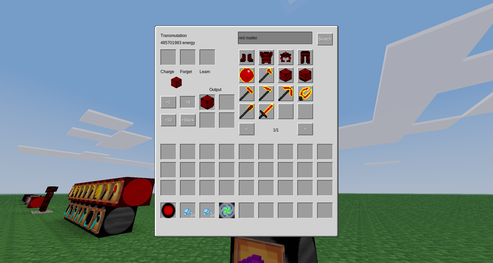

# ExchangeClone

Allows players to turn items into energy, and energy into items. Supports all items in Minetest Game and MineClone 2, and anything that can be made from them! Also adds a whole bunch of other stuff.

Welcome to the dev branch! This is the branch I'm currently working on, so it's likely that there are bugs.

ExchangeClone is tested with the latest release of Minetest, Minetest Game, MineClone2, and Mineclonia.

## ExchangeClone's Features:
* Energy
* Philosopher's Stone
* Transmutation Table
* Alchemical Tome
* Exchange Orb
* Deconstructor
* Constructor
* Energy Collectors
* Upgraded Fuels
* Dark Matter and Red Matter
* Dark and Red Matter Tools
* Dark and Red Matter Armor
* Dark and Red Matter Furnaces
* PESA (deprecated, WILL BE REMOVED in 7.0)

See the [wiki](https://github.com/ThePython10110/ExchangeClone/wiki) for more information

[GitHub repo](https://github.com/thepython10110/exchangeclone)

[Forum topic](https://forum.minetest.net/viewtopic.php?f=9&t=29473)

[ContentDB](https://content.minetest.net/packages/ThePython/exchangeclone)

[Wiki](https://github.com/ThePython10110/ExchangeClone/wiki)

[Direct download](https://github.com/ThePython10110/ExchangeClone/archive/refs/heads/main.zip)

Dependencies: Minetest Game or MineClone.

## Known issues:
* Dark/Red Matter armor don't work they way they should, especially in MTG. I would greatly appreciate a PR that makes them work more like ProjectE.
* The sword/katar AOE ability does not take upgrades into account. This will probably not be fixed (MCL)
* For technical reasons (making them work with MCL hoppers), Exchange Orbs and Upgrades can be used as fuel. This isn't really a problem, but it will be removed once I decide the new hopper API is new enough that most people are using it.
* Dark/Red Matter Shears will sometimes (randomly) be treated as normal shears when used by dispensers. This will not be fixed.
* In Mineclonia, when inserting items into Dark/Red Matter Furnaces with hoppers, they will not start at the correct speed, instead being limited to a maximum of 1 item/second. This will not be fixed unless Mineclonia changes how things work.
* In Mineclonia, hoppers can put invalid items into Energy Collectors.
* DM/RM tools and armor aren't great... the DM tools are TOO fast and the armor is (depending on which game you're playing), too good or not good enough. I would love it if someone with more patience would submit a PR to improve them. I would like them to be as close to ProjectE as possible, and as similar as possible between MTG and MCL... but I just hate doing that kind of thing.
* DM tools mine RM nodes too quickly for something that doesn't drop (MCL).

**If you have a suggestion or notice a bug, visit the [GitHub issues page](https://github.com/thepython10110/exchangeclone/issues).**

## Sources/license:
* Code: Forked and *heavily* modified from Enchant97's mod [Element Exchange](https://github.com/enchant97/minetest_element_exchange) (at this point, I'd say 95% of the code is my own). Both this mod and Element Exchange are licenced under GPLv3+. Based on Equivalent Exchange and ProjectE, mods for MineCraft.
* Textures:
    * Energy Collector, Deconstructor, Constructor: Directly from Element Exchange, GPLv3+.
    * Exchange Orb: *Slightly* modified from Element Exchange (I just changed the color to white so it could change colors correctly)
    * Alchemical Coal, Mobius Fuel, and Aeternalis Fuel: modified versions of MineClone's coal texture (CC-BY-SA-3.0).
    * Covalence Dust: Slightly modified from MineClon(e2/ia)'s redstone dust (CC-BY-SA-3.0)
    * Dark and Red Matter Armor (and maybe eventually Gem Armor): modified versions of diamond armor from 3D Armor (CC-BY-SA-3.0) and `mcl_armor` (CC-BY-SA-3.0).
* All other textures (and sounds): Created by me, inspired by Equivalent Exchange and licensed under CC-BY-SA-3.0.

-----

## Changelog

Look at this fancy expanding changelog

### TODO:
* Finish changelog
* Finish wiki
* Test everything in MTG, MCL2, and MCLA (and 5.7)
    * Everything breaks properly
    * Item transfer mods work correctly
    * Shears seem to work fine (MCL)
    * Other tools work

### v6.0 (The Compatibility Update)
This update took a while... there was just so much that had to be done.

**The biggest changes:**
*   I'm naming updates now for some reason.
*   Automatic energy values! This means I don't have to manually add energy values for every single item. If it's craftable or cookable, ExchangeClone will automatically figure out an energy value for it. There's also an API (with very little documentation because I'm lazy) for adding custom energy recipes and recipe types.
*   The minimum Minetest version has been changed to 5.7.0, because I'm never going to test on any older versions. Of course, it will probably still work (at least mostly) on other versions, but I can't promise anything.
*   Players can now have up to 1 trillion personal energy!
*   Energy values now better match ProjectE's.
*   Changed A LOT of things internally. Any mods depending on ExchangeClone (probably not very many, which is good) will probably need to update stuff.
*   **The PESA will be removed in version 7.0.**

I didn't get to everything I wanted to, mostly because the automatic energy values required quite a lot of work.

#### Full Changelog**
* New Features:
    * Automatically generated energy values! Based on crafting and cooking recipes.
        * Depending on the number of crafting recipes you have, this could increase load times. This is definitely a bit of an issue in MineClone2, probably due to the number of banner/dye recipes. Eventually (hopefully), loom functionality will be added and this will improve quite a bit.
        * Technic recipe types (grinding, alloying, etc.) work, as long as their `output_size` is 1 (meaning they only output one item at a time, so not the centrifuge or separator).
        * Also supports Mineclonia's stonecutter recipes, Netherite upgrades, and more.
        * Added various ways of adding custom energy values or energy recipes (`exchangeclone.register_alias`, `exchangeclone.register_craft_type`, and `exchangeclone.register_craft`)
    * Support for Pipeworks and Hopper mods! (MCL hoppers already worked)
    * Added energy values for More Ores and Technic.
    * Infinite food (costs 64 energy to use, but isn't consumed, equal to MCL steak)
    * Alchemical Chests, Alchemical Bags, and Advanced Alchemical Chests
    * Labels on items in the Transmutation GUI showing how many items can be created.
    * Added comma separators when energy is shown (to make it easier to identify large numbers)
    * Covalence Dust
        * Left-click (or aux1-left-click in MCL) with Philosopher's Stone to open repairing menu; only tools with an energy value can be repaired)
    * 5 more Energy Collectors (to go with the increased energy limit)
    * Chat commands to set/add/remove energy from a player (requires `privs` privilege):
        * `/add_player_energy [player] value` (player defaults to self, value can be negative)
        * `/set_player_energy [player] value` (player defaults to self, value can be "limit" to set to the limit)
* Changes:
    * **Removed the compatibility thing for Constructors, Deconstructors, and Energy Collectors** (there seems to have been a bug that was making it happen too much) meaning that **old worlds REALLY SHOULD NOT be updated to this version.** And they probably shouldn't have been updated to 5.0 either. So... sorry if I ruined things for you. In the future, I will try to make everything a lot more backwards-compatible.
    * ExchangeClone is now a modpack for [annoying reasons](https://forum.minetest.net/viewtopic.php?f=47&p=429775s).
        * Energy values are now in `zzzz_exchangeclone_init/base_energy_values.lua`, and are laid out differently, and aliases now work.
    * The default energy value is no longer 1 but none.
    * The 2.14-billion-ish personal energy limit is has been increased to 1,000,000,000,000 (1 trillion). Any higher (literally ANY higher) and there are precision-based exploits like being able to create an unlimited amount of anything with an energy value less than 1. I considered finding some library for arbitrary precision in Lua, but decided it was too much work (and nobody really needs more than a trillion energy anyway).
    * Energy values are now multiples of 0.05 instead of 0.25, for no real reason.
    * MineClon(e2/ia) energy values now (mostly) match ProjectE's, with a few minor differences, including these:
        * Emeralds are still worth less than diamonds because of villager trades (in my opinion, this should be changed in ProjectE as well)
        * Dyes are worth different amounts based on their crafting recipes, so different colors of things are worth different amounts.
        * Since fractional energy values are allowed, some energy values may be slightly different.
    * A couple changes involving the Philosopher's Stone:
        * Ender pearls can now be crafted with 4 iron and the Philosopher's Stone (MCL).
        * Copper's energy value has been changed (128 instead of 85), and the recipe has been changed accordingly.
        * Ice and obsidian can now be transmuted into water and lava, respectively.
        * It is now impossible to transmute between bedrock and barriers (MCL). I thought it was funny originally, but now I'm realizing that I don't want this to be annoying to people who run servers (are there any servers with this mod?)
    * It now costs 4 dark/red matter to make a block, which is great news if you already have some (because they're now worth more), but not so great if you don't. Sorry or you're welcome.
    * Tool abilities now have no energy cost (to match ProjectE).
    * Tool abilities now take upgrades into account (silk touch, fortune, etc.) except for the sword AOE ability (which would require irritating hacky workarounds).
    * Several neutral mobs (endermen, spiders, piglins) are now affected by the dark/red matter sword in "slay hostile" mode, to match ProjectE.
    * No more mod whitelist.
* Bugfixes:
    * Fixed potion energy values (MCL)
    * Fixed Red Matter Shield recipe (MTG)
    * Fixed other modes of DM/RM tools not having energy values
    * Deconstructors and Constructors will now continue trying to work instead of just stopping when there is too much or too little energy.
    * Tool abilities now update nodes that require support (torches, sand, etc.).
    * MCL raw copper, iron, and gold blocks now correctly double in DM/RM furnaces.
    * Finally fixed that bug where things don't drop when exploded.

### v5.4
* Fixed a minor bug with the Energy Collector (thanks @programmerjake!)
* Now adding v's to version numbers... because it looks nice, I guess.

### 5.3
* Fixed shearing beehives in MCL (thanks @Ranko-Saotome!)

### 5.2
* Removed unnecessary logging every time players take damage (I was testing stuff out with the armor, thanks @Ranko-Saotome for reporting)

### 5.1
* New Features:
    * Added new Mineclonia items (pottery, sculk, smithing templates, suspicious sand, etc.)
* Changes:
    * Changed a couple of energy values (enchanted golden apple was way too cheap, clay seemed too expensive)
    * Sword/Katar AOE damage now matches ProjectE (DM sword = 12, RM sword = 16, katar = 1000... kinda OP). All AOE cooldowns (including swinging swords/katar) are now 0.7 seconds.
    * DM/RM pickaxe/hammer/morningstar dig times now are approximately the same as ProjectE (at full charge), meaning they are now probably annoying fast.
    * Red Matter Armor no longer increases player health (the wiki lied to me).
    * A couple of changes to DM/RM armor in MineClone, which may or may not be noticeable. I really don't know.
* Bugfixes:
    * Fixed Mineclonia energy values (I foolishly assumed that all items would have the same itemstrings and groups, thanks @Ranko-Saotome for reporting this).

### 5.0 (bigger release than any before it)
**I would recommend not updating to or past this version (any Constructors, Deconstructors, and Energy Collectors may become unusable...)**
* New features:
    * Added a [wiki](https://github.com/ThePython10110/ExchangeClone/wiki)! This is where you can find more complete information on pretty much everything.
        * Because the wiki exists, I won't be including anywhere near as many details about how features work in the changelog.
    * Added the Transmutation Table(t): Much better than the constructor/deconstructor.
    * Alchemical Tome: Instantly teaches every item with an energy value to the Transmutation Table(t).
    * Dark/Red Matter Furnaces: Can be powered by Energy Collectors, much faster, and sometimes double ores.
    * Upgraded Energy Collectors: Now MK1-MK5, use personal energy by default.
    * Upgrades (MCL only)
        * Upgrades can give dark/red matter tools fortune, looting, fire aspect, and silk touch (note: abilities ignore enchantments)
        * Upgrades can give dark/red matter armor thorns and frost walker
    * Energy values for [Portability](https://github.com/thepython10110/Portability).
    * Added energy value for Why's Falling Block Tool
    * Mod developers can now set their own energy values by setting `exchangeclone_custom_energy` in the item/node definition.
    * The Vital patch for the ExchangeClone ability sound is now included.
* Changes
    * The changelog now has the most recent updates first, to make things easier to find.
    * Energy for Dark/Red Matter tool abilities (as well as the Transmutation Table) is no longer stored in an orb, but inside the player (called "personal energy").
        * The amount of energy you currently have stored is visible in the bottom right of the screen.
        * Because of this, the PESA is now useless and deprecated. It will be removed after a few releases (so probably a couple months at least). Remove any Exchange Orbs from your personal storage.
        * Energy Collectors, Deconstructors, and Constructors now use the placer's personal energy when they do not contain an orb.
    * A lot of items (including DM/RM tools and armor) will not burn in lava in MineClone2.
    * Deconstructors and Constructors now work with hoppers and don't have that annoying lag thing when deconstructing
        * The lag (not *technically* lag, but still) was caused by the fact that Enchant97 had them use node timers. Now they don't.
        * (De)constructors also now use the placer's personal energy when they do not contain an orb.
    * Red Matter Armor now sets your maximum health to 200 instead of 2000
    * Exchange Orbs are now 18x better as fuel than they used to be
    * DM/RM Shovels will now only create paths on nodes below air.
* Bugfixes:
    * Fall damage now works normally when not wearing dark/red matter armor... I accidentally made it decrease regardless of whether armor was worn or not.
    * I must have skipped a row while going through MineClone's mod list. Several mods starting with `mcl_b...` or `mcl_c...` have been added to the whitelist.
    * Fixed right-clicking with an orb not showing charge
    * Removed unnecessary chat logging when deconstructing/constructing
    * The names for Dark and Red Matter Armor now are correct in MineClone2
    * Removed unnecessary tool repair recipes from dark/red matter tools/armor
    * Fixed a couple of armor texture issues in Minetest Game (though it still looks like diamond armor; 3D Armor doesn't support texture modifiers)
    * The Red Katar is now actually craftable in Minetest Game (I just forgot that shears were only in MCL2)
    * A couple other minor things that I've forgotten about.
    * Fixed an error message about the `invert` texture modifier

### 4.4
* Added Mineclonia Support (or at least, I thought I did)
* The version numbers kind of disagree around here and I'm too lazy to fix it.

### 4.3
* New features:
    * New items from Why (flying sausage, useful green potatoes, etc.)
* Changes:
    * The changelog now lives here!
    * Exchange Orbs now change color based on the amount of energy (black->red->green->blue->magenta).
    * Exchange Orbs now have a maximum energy of 51,200,000 (to match Equivalent Exchange's Klein Star Omegas).
    * Water is now worth 0 instead of 1 (since it's infinite)
* Bugfixes:
    * Exchange Orbs will now correctly display their energy value (I typed `orb` instead of `exchange_orb` in the energy value list)

### 4.2
* Fixed a dependency error (thanks, @opfromthestart!)

### 4.1
* Added energy values for new armor/tools
* Removed unnecessary chestplate image (not only is it unused, but I put it in the wrong folder for some reason)

### 4.0
* New features:
    * The "Features that I plan on adding eventually" list below
    * Cooldowns for tool abilities to limit lag
    * Red Katar (combination of sword, axe, hoe, and shears)
    * Red Morningstar (combination of hammer, pickaxe, and shovel)
    * Dark Matter Armor (full set gives immunity to lava/fire and drowning)
    * Red Matter Armor (full set gives lava/fire/drowning immunity PLUS 2000 health, although you may want HUD Bars to see it)
    * Added energy values for MineClone's new items.
* Changes:
    * Changed the amount of damage done by Dark/Red Matter Sword special abilities (used to be `damage/distance`, now is `damage-distance`)
    * A whole bunch of things that won't be noticible when playing, mostly code reorganization. It's *possible* that tools that mine multiple nodes at a time (hammer, pickaxe, hoe, katar, and morningstar) will be slightly less laggy
    * Texture/sound license changed to CC-BY-SA-3.0 (because GPLv3+ isn't really meant as a media license).
* Bugfixes:
    * Fixed an issue where MineClone dispensers could ONLY be used with Dark/Red Matter Shears (whoops).

### 3.2
* Set MineClone mod namespace to `exchangeclone`

### 3.1
* Added new energy values from Why (and Why's new Minetest Game energy values)
* Fixed crash based on PESA inventory movement
* Added `mcl_blackstone` to the mod whitelist

### 3.0 (the formerly most interesting release)
* New features:
    * Added Alchemical Coal, Mobius Fuel, Aeternalis Fuel, Dark Matter (blocks and orbs), and Red Matter (blocks and orbs)
    * Added PESA (Personal Energy Storage Accessor)
        * A single inventory slot in which an orb can be placed. Energy from the orb is used for special abilities.
    * Added Dark and Red Matter tools
        * Faster than any other tools (in unmodded MTG/MCL), each has an ability
        * Special abilities that break nodes (as well as shearing) drop items directly on the player.
        * Swords:
            * Can damage all mobs within a radius (Red Matter sword can toggle between hostile/all mobs), costing 384 energy.
        * Pickaxes:
            * Has 3x1 modes (long, tall, and wide, all slightly slower)
            * Can mine a full vein of ores, dropping items and experience on the player and costing 8 energy per node broken
        * Axes:
            * Can break all wood and leaves within a radius, costing 8 energy per node broken.
        * Shovels:
            * Can break all shovely nodes within a radius, costing 8 energy per node broken
            * Can create paths in a radius, costing 4 energy per node
        * Hoes:
            * Breaks dirt incredibly quickly
            * Has a 3x3 mode for digging dirt (slightly slower)
            * Can till all dirt within a radius, costs 4 energy per node
        * Hammers:
            * Breaks pickaxey nodes in a 3x3 area
            * Can break all pickaxey nodes within a radius, costing 8 energy per node broken
        * Shears:
            * More wool/mushrooms dropped when shearing, chance of cloning sheep/mooshrooms
            * Can shear all shearable plants/cobwebs within a radius, costing 8 energy per node broken.
* Changes:
    * Added a mod whitelist in `energy.lua`, any item from a mod NOT in the whitelist (`exchangeclone.whitelisted_mods`) will have an energy value of 0
    * Orbs now show their energy on right click instead of left click
    * Changed Philosopher's Stone controls to make everything more consistant
    * The Energy Collector setting is now energy/second instead of second/energy to fit much higher costs than Element Exchange (default is 5 energy/s).
    * Set gravel value to 1 to match sand/stone/dirt/etc (MineClone).
    * Tuff, blackstone, and basalt are now transmutable (MineClone).
    * A couple of minor transmutation changes (MineClone).
    * Changed emerald value to 4096 (MineClone).
    * Gold cannot be crafted into diamonds using the PS; it can now be crafted into emeralds and emeralds into diamonds (MineClone).
    * The PS's enchanting table now is limited to 8-bookshelf enchantments to make it more balanced (MineClone).
    * Fixed terracotta values (MineClone)
    * Enchanted tools/armor are now worth the same amount as unenchanted tools/armor instead of twice as much (MineClone).
    * Enchanted tools/armor cannot be created by the Constructor (MineClone).
    * It is now impossible to get stacks of invalid sizes with the Constructor (>16 ender pearls or >1 pickaxe, for example)
* Bugfixes:
    * Fixed freezing when attempting to deconstruct 0-energy items
    * The Constructor, Deconstructor, and Energy Collector are now not unbreakable in MineClone (I really should test in survival).
    * Copper blocks are now worth 4 times as much as copper ingots instead of 9 (MineClone).
    * The Energy Collector now drops its contents when broken (MineClone)
    * Fixed Exchange Orb energy value (forgot to change it after changing the recipe)
        * Changed Constructor, Deconstructor, and Collector recipes and energy values to make them cheaper.

### 2.0
* New features:
    * Added a changelog (you're reading it now!)
    * Added all items from Why (a MineClone modpack I made)
    * Added Philosopher's Stone (these controls are now inaccurate as of 3.0)
        * Left click to increase range (minimum = 0, maximum = 4).
        * Shift+left click to decrease range.
        * Aux1+left click to open enchanting table (MineClone only).
        * Right click to transmute nodes in range (mode 1).
        * Shift+right click to transmute nodes in range (mode 2, has some differences).
        * Aux1+right click to open crafting table (MineClone only).
        * Can use to craft coal into iron, mese into diamonds, etc.
* Changes:
    * Changed version numbers from x.x.x to x.x.
    * Changed the recipe for the Exchange Orb
        * New recipe is a Philosopher's Stone in the middle, diamonds in the corners, and iron/steel ingots on the sides.
    * Changed the energy values of tin, copper, and bronze in Minetest Game.
    * Renamed images to reflect mod name change ("exchangeclone" instead of "ee" for Element Exchange)
    * Deleted unnecessary "config.lua"
* Bugfixes:
    * Ghost Blocks (from Why) are now worth 0 instead of 1 (to prevent infinite energy)
    * Fixed stairs and slabs not working in Minetest Game

### 1.0.0
* Initial release
* New features:
    * MineClone support, including (sort of) hoppers
    * Added the ability to add items by group
    * Shift-clicking (listrings)!
* Changes:
    * Completely redone recipes, now includes all items.
    * Tools' energy value now depends on wear.
* Bugfixes:
    * Items can no longer be put in the Constructor's output slot.
    * Honestly, I'm going to count the broken energy values as a bug...

### Features that I plan on adding eventually:
* Achievements
* ~~As soon as Minetest 5.8 comes out, better textures for armor...~~ Don't want to limit it to 5.8
* Divining Rods
* Rings (I'll probably add a new PESA-like item for holding rings)
    * Archangel's Smite (arrows will not track targets, MineClone only)
    * Ring of Ignition
    * Zero Ring
    * Swiftwolf's Rending Gale (but without the force field; basically Why's Flying Sausage with a different texture and maybe lightning in MCL)
    * Harvest Band (maybe not)
    * Ring of Arcana (possibly without the Harvest Band)
* Gem Armor
* Catalytic Lens
* Mind, Life, Body, and Soul Stones
* Mercurial Eye
* Talisman of Repair
* Gem of Eternal Density
* Probably other things