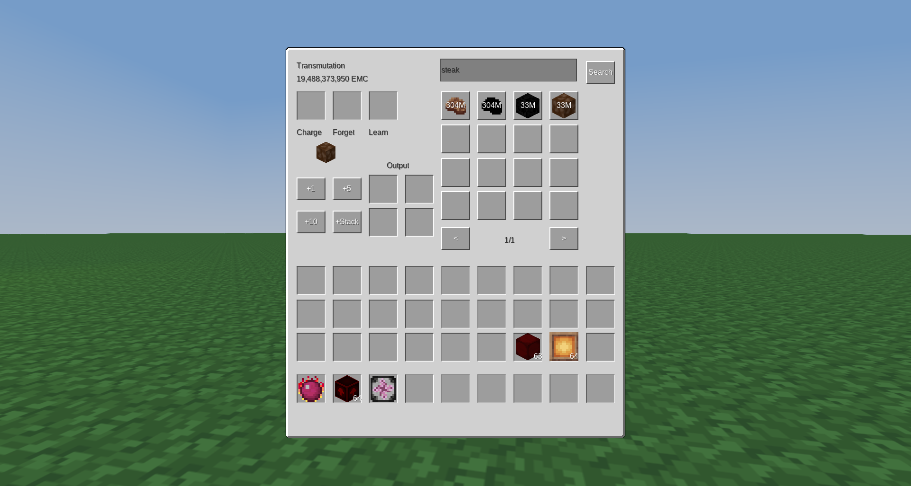
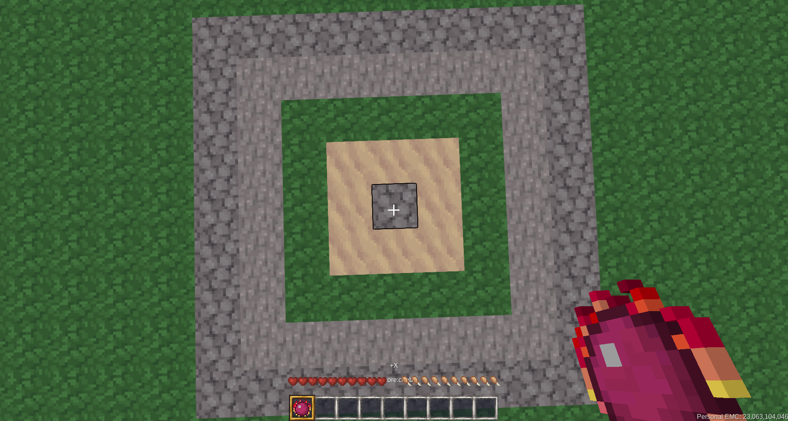

# ExchangeClone

Allows players to turn items into EMC, or Energy Matter Covalence, and EMC into items. Also adds a whole bunch of other stuff.

### Mod/game support
ExchangeClone upports all items in the following mods/games (and anything that can be made from them):
* Minetest Game
* MineClone2
* Mineclonia
* Technic
* More Ores
* Ethereal
* Nether
* Mobs Redo API and Mobs Animals
* Animalia

ExchangeClone is tested with the latest release of Minetest, Minetest Game, MineClone2, and Mineclonia.

### Links
See the [wiki](https://github.com/ThePython10110/ExchangeClone/wiki) for more information

[GitHub repo](https://github.com/thepython10110/exchangeclone)

If you would like to see the latest changes, check out (pun) the dev branch! Beware of bugs.

[Forum topic](https://forum.minetest.net/viewtopic.php?f=9&t=29473)

[ContentDB](https://content.minetest.net/packages/ThePython/exchangeclone)

[Wiki](https://github.com/ThePython10110/ExchangeClone/wiki)

[Direct download](https://github.com/ThePython10110/ExchangeClone/archive/refs/heads/main.zip)

Dependencies: Minetest Game or MineClone.

## Known issues:
* The sword/katar AOE ability does not take upgrades (looting, fire aspect, etc.) into account. This will probably not be fixed (MCL)
* Klein Stars and Upgrades can be used as fuel. This isn't really a problem, but it will probably be removed once I decide the new hopper API is old enough that most people are using it.
* Dark/Red Matter Shears will sometimes (randomly) be treated as normal shears when used by dispensers. This will not be fixed.
* In Mineclonia, when inserting items into Dark/Red Matter Furnaces with hoppers, they will not start at the correct speed, instead being limited to a maximum of 1 item/second. This will not be fixed unless Mineclonia changes how things work.
* In Mineclonia, hoppers can put invalid items into Energy Collectors. This will not be fixed.
* Tools do not show the wear bar (to show the charge level) when first created or crafted. It only appears after changing the range. This will not be fixed.
* Unfortunately, caused by the performance improvements to various tool abilities, using the shear ability on sea grass (MCL) will also remove the sand below the sea grass. I can't think of a good way to fix it.
* Dark and Red Matter Armor can make the player invincible. This is an [engine problem](https://github.com/minetest/minetest/issues/14344) that I can't fix.
* Mobs Redo (and mods that use it) don't care that DM/RM tools are supposed to be unbreakable and add wear to them anyway.
* Covalence Dust and the Talisman of Repair cannot repair certain tools. This will not be fixed.
* DM/RM tools are too fast in MTG (can't figure out why)
* When placing torches with a pick/morningstar, if the placement fails, it still costs energy. This will probably not be fixed.

**If you have a suggestion or notice a bug that isn't on this list, visit the [GitHub issues page](https://github.com/thepython10110/exchangeclone/issues).**

## Sources/licenses:
* Ideas:
    * Based on the Minecraft mod Equivalent Exchange 2 and the modern version, ProjectE (both MIT, though the source for EE2 is unavailable)
    * Also includes some features from ProjectExpansion, an expansion to ProjectE (MIT).
* Code: GPLv3+
    * Originally started as a fork of Enchant97's mod [Element Exchange](https://github.com/enchant97/minetest_element_exchange) (GPLv3+).
    * Some code copied/modified from other mods, of course. Sometimes I remember to give credit, sometimes I don't.
* Textures:
    * Upgrader and Upgrades: Created by me (CC-BY-SA-3.0)
    * Energy Collectors:
        * Base: Glowstone block from MineClone2 (CC-BY-SA-3.0)
        * Overlay: Created by me (CC-BY-SA-3.0)
    * Armor (not the inventory image): Slightly modified from ProjectE (just moved stuff around so it fit onto Minetest player models correctly).
    * Alchemical Chest: Modified version of EE2/ProjectE's textures, extended to 16x16 instead of 14x14 (MIT)
    * Advanced Alchemical Chests: Modified version of ProjectExpansion's textures, extended to 16x16 instead of 14x14 (MIT)
    * Magnum Stars and EMC Link: Directly from ProjectExpansion (MIT)
    * All other textures: Directly from EE2/ProjectE (MIT)
* Sounds:
    * Sound for picking up items with BHB or Void Ring: Copied from Mineclonia
    * All other sounds: Directly from EE2/ProjectE (MIT)

You can find the old textures and sounds by going back to previous commits in GitHub.