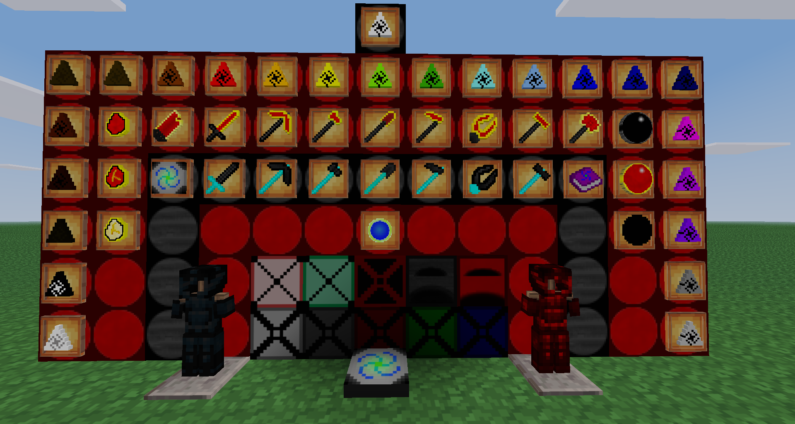
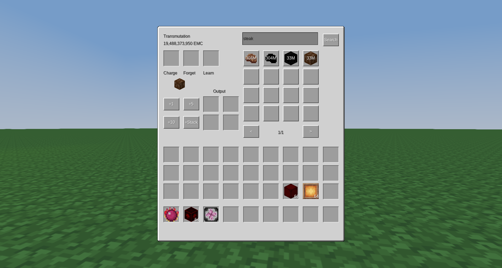
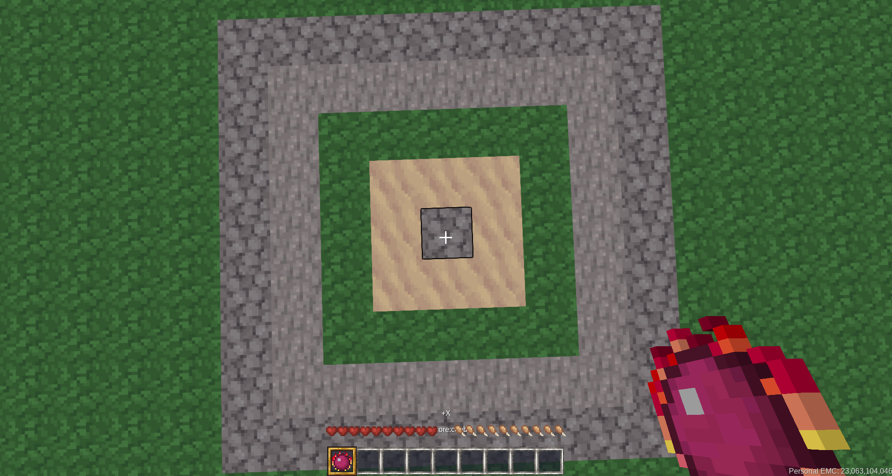

# ExchangeClone

Allows players to turn items into EMC, or Energy Matter Covalence, and EMC into items. Also adds a whole bunch of other stuff.

### Mod/game support
ExchangeClone supports all items in the following mods/games (and anything that can be made from them):
* Minetest Game
* VoxeLibre
* Mineclonia
* Technic
* More Ores
* Ethereal
* Nether
* Mobs Redo API and Mobs Animals
* Animalia

ExchangeClone is tested with the latest release of Luanti, Minetest Game, VoxeLibre, and Mineclonia.

### Links
See the [wiki](https://github.com/ThePython10110/ExchangeClone/wiki) for more information

[GitHub repo](https://github.com/thepython10110/exchangeclone)

If you would like to see the latest changes, check out (pun) the dev branch! Beware of bugs.

[Forum topic](https://forum.luanti.org/viewtopic.php?f=9&t=29473)

[ContentDB](https://content.luanti.org/packages/ThePython/exchangeclone)

[Wiki](https://github.com/ThePython10110/ExchangeClone/wiki)

[Direct download](https://github.com/ThePython10110/ExchangeClone/archive/refs/heads/main.zip)

Dependencies: Minetest Game, VoxeLibre, or Mineclonia.

## Differences from ProjectE/ProjectExpansion
* Obviously, recipies have been modified for Minetest Game.
* Fractional EMC! I got tired of things like slabs and glass panes not having EMC values, so now EMC is rounded to the nearest multiple of 0.05 (although that's completely arbitrary, just so it looks nice).
* The EMC limit is 1 trillion. Technically, I could make it 10 trillion with some math (since I'm not using negative numbers and I'm effectively only using a fifth of the possible values by rounding to 0.05), but that introduces a lot of complexity that I don't feel like dealing with. 1,000,000,000,000 EMC should be enough for anyone.
* EMC appears in the bottom right, instead of the top left, to avoid overlapping with the chat, debug info, and minimap
* I really wanted DM/RM tools to be enchantable, so I added the Upgrader and Upgrades (in VL and Mineclonia) to allow for that.
* The buttons for various abilities are different, just because you can't set up custom keys in Luanti. This means there's a whole lot of "sneak+aux1+right-click" and things like that.
* Energy Collectors work the way that the Power Flower Bonsai Pots work in ProjectExpansion, adding EMC directly to the placer's personal EMC.
* There is only one level of EMC Link, which is instant.
* Red Matter Pickaxes and Morningstars now place torches when right-clicking on non-ore blocks.
* Emeralds are worth half as much as diamonds in MCL because villagers are ridiculously overpowered in ProjectE.
* All Gems of Eternal Density and Void Rings share the *same filter* (per-player, not per-item).
* Things that don't exist:
  * Swiftwolf's Rending Gale (I don't want to deal with flight permissions)
  * Interdiction torches (entities are laggy enough already)
  * Gem armor (again, flight permissions, plus several of the abilities wouldn't work)
  * Anything that costs more than 1 trillion EMC
  * EMC Relays (unnecessary)
  * Energy Condensers (unnecessary)
  * Power Flower Bonsai Pots
  * Several other things...

## Known issues:
* The sword/katar AOE ability does not take upgrades (looting, fire aspect, etc.) into account. This will probably not be fixed (MCL)
* Dark/Red Matter Shears will sometimes (randomly) be treated as normal shears when used by MCL dispensers. This will not be fixed because it would require me to completely override *all* the code for dispensers, and I don't want to do that.
* In Mineclonia, when inserting items into Dark/Red Matter Furnaces with hoppers, they will not start at the correct speed, instead being limited to a maximum of 1 item/second. This will not be fixed unless Mineclonia changes how things work.
* In Mineclonia, hoppers can put invalid items into Energy Collectors. This will not be fixed.
* Tools do not show the wear bar (to show the charge level) when first created or crafted. It only appears after changing the range. This will not be fixed.
* Due to changes to various tool abilities in v7.0, using the shear ability on sea grass (MCL) will also remove the sand below the sea grass. I can't think of a good way to fix it.
* Mobs Redo (and mods that use it) don't care that DM/RM tools are supposed to be unbreakable and add wear to them anyway.
* Covalence Dust and the Talisman of Repair cannot repair certain tools. This will not be fixed.
* DM/RM tools are too fast in MTG (can't figure out why)
* When placing torches with a Red Matter Pickaxe or Morningstar, if the placement fails, it still costs EMC. This will probably not be fixed.
* If you have "Random mod load order" on in Minetest settings, EMC registration will *not* work correctly, since it relies on being able to override `core.register_item` before any items have been registered.

**If you have a suggestion or notice a bug that isn't on this list, visit the [GitHub issues page](https://github.com/thepython10110/exchangeclone/issues).**

## Sources/licenses:
* Ideas:
    * Based on the Minecraft mod Equivalent Exchange 2 and the modern version, ProjectE (both MIT, though the source for EE2 is unavailable)
    * Also includes some features from ProjectExpansion, an expansion to ProjectE (MIT).
* Code: GPLv3+
    * Originally started as a fork of Enchant97's mod [Element Exchange](https://github.com/enchant97/minetest_element_exchange) (GPLv3+), although I've completely rewritten basically everything. Probably <1% of the code comes from there at this point.
    * Some code copied/modified from other mods/games. Sometimes I remember to give credit, sometimes I don't.
* Textures:
    * Textures made by me (CC-BY-SA-3.0):
      * Upgrader
      * Upgrades
      * DM/RM tools (besides Katar/Morningstar)
    * Minetest Game (CC-BY-SA-3.0):
      * Armor inventory image (recolored)
    * VoxeLibre/Mineclonia (CC-BY-SA-3.0):
      * Fuel (modified) from coal texture
      * Covalence Dust (modified) from redstone texture
    * ProjectExpansion (MIT):
      * Advanced Alchemical Chests (extended to 16x16 instead of 14x14)
      * Magnum Stars
      * EMC Link
      * Alchemical Books
      * Matter above Red Matter
    * Element Exchange (GPLv3+):
      * Constructor and Deconstructor (deprecated, but still exist for backwards compatibility)
    * ProjectE:
      * Armor (not the inventory image). I moved stuff around so it fit onto Luanti player models correctly.
      * Alchemical Chest (extended to 16x16)
      * All other textures
* Sounds:
    * Sound for picking up items with BHB or Void Ring: Copied from Mineclonia
    * All other sounds: Directly from EE2/ProjectE (MIT)

You can find the old textures and sounds (made by me before I realized ProjectE was MIT) by going back to previous commits in GitHub.